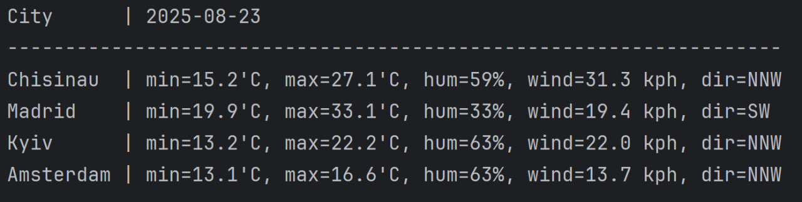

# WeatherAPI Code Challenge

This Kotlin application fetches the weather **forecast for tomorrow** for the following cities:

- Chisinau  
- Madrid  
- Kyiv  
- Amsterdam

It uses the [WeatherAPI.com](https://www.weatherapi.com/) and prints a **table to STDOUT** showing:

- Minimum Temperature (`min` in °C)
- Maximum Temperature (`max` in °C)
- Humidity (%)
- Wind Speed (kph)
- Dominant Wind Direction

---

## Technologies Used

- **Kotlin**
- **Gradle**
- **Retrofit** (API client)
- **Moshi** (JSON parsing)
- **OkHttp Logging Interceptor**
- **Kotlin Coroutines**

---

## How to Run

### 1. Set up environment variables

Set your WeatherAPI key:

```bash
# On Linux/macOS:
export WEATHER_API_KEY=your_api_key_here

# On Windows (PowerShell):
$env:WEATHER_API_KEY="your_api_key_here"
```

> (Optional) Override default cities:
```bash
export CITIES="London,Paris,Tokyo,New York"
```

---

### 2. Run via Gradle

```bash
./gradlew run
```

Or from IntelliJ IDEA:
- Use the `run` Gradle task
- Or create an Application Run Configuration with `weather.AppKt` as Main class

---

## Output Example




